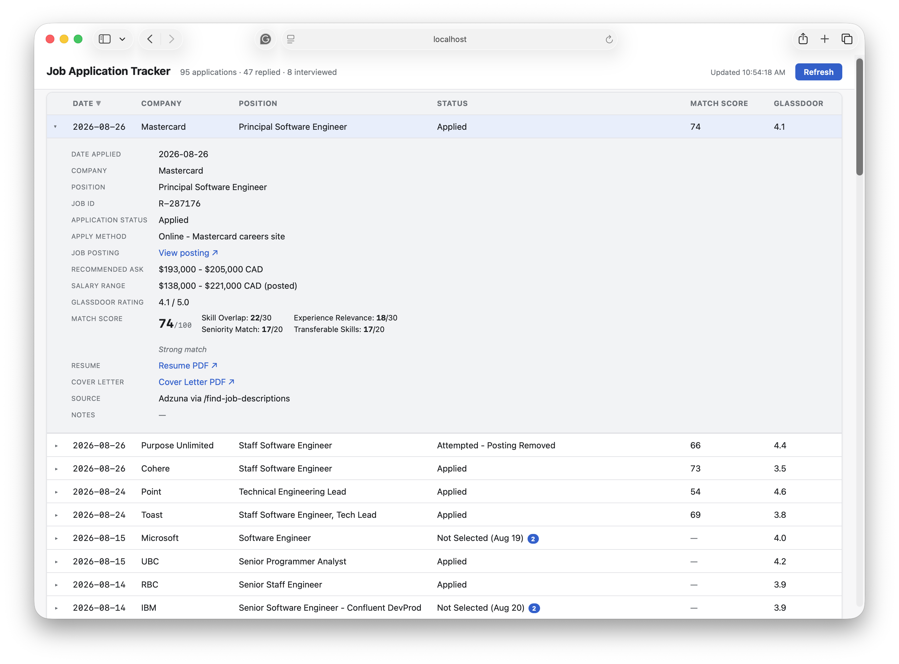

# Job OS
The job search in 2026 is broken and applicants can feel powerless in an opaque system that often works against them. It's time to change that. Job OS is a set of AI agent skills, which in combination, give you an environment to build the next steps in your career.

## TL;DR
This project leverages agentic AI to put the power back into the job seeker's hands. This repo provides a structured layout, a bluepreint, a data template, and several AI-driven skills that help with the following:

- Helps tailor resumes for specific job descriptions without embellishing*.
- Helps find local job postings that match your career goals and salary expectations, while learning your job application patterns. WIP; YMMV.
- Helps track the application status of your job search journey — browse it live in the job tracker (see image below).
- Helps find gaps that you should prep for in upcoming interviews.

\**Instructed to follow bullet points from template as close to verbatim as possible. If the resume summary or cover letter doesn't sound genuine, you can ask your AI coding agent to fix it.*

> **Primarily built and tested on Claude Code.** Every skill is written in the vendor-neutral [Agent Skills](https://code.claude.com/docs/en/agent-sdk/skills) format and shares one `AGENTS.md`, so other agentic tools (Codex CLI, Gemini CLI, Copilot CLI, OpenCode) should work — but Claude Code is where the day-to-day dogfooding happens, so treat it as the most reliable path if something behaves differently elsewhere. See "Choosing a tool & what it costs" below before picking one.




### Quickstart
- In a text editor, provide everything about your career in the `template` folder.
- Add your goals to the `variable-input/career-goals` folder.
- Optionally, add a `variable-input/salary-expectations.md`.
- Start your AI coding agent's session in the root folder (see Requirements below for setup, per tool).
- (Optional) Don't want the default look? `/match-resume-style <path-to-a-resume-you-like>` reworks the style to match it, ATS red flags aside.
- Run `/find-job-descriptions` to find matches.
- Run `/tailor-resume [job description name]` to tailor to a specific job.
- (Optional, run once) If you already have an existing job-tracking file from before this repo, import it: `/import-applications <path-to-your-file>`.
- Apply for the job manually using the tailored resume in the `/output` folder.
- Run `/applied [job description name]` to track where you appied.
- Run `/prep-interview` to find gaps to work on once an interview is scheduled.
- Run `/update-status [job description name]` to update your application progress.
- Run `/career-coach` anytime for an honest read on what to work on next.


## Problem Statement
The modern job search requires tailoring a specialized resume for each individual job decription, if you don't want to be filtered out by ATS before any actual human sees your application.

Applicant Tracking Systems (ATS) can look for keywords for a role, and reject your application if your resume does not match. Even if a keyword is present, structure or formatting inconsistencies can disqualify it from being parsed correctly.

Manually tailoring your resume to optimize it for each job application can be very time-consuming - and it still may not be ATS-friendly. You can use AI to tailor your resue to a specific job description, but there will be hallucinations that need editing. In worse cases, the hallucinations can make the applicant look like a liar.


## Solution
The solution is to provide data that is the most relevant to the postion you're applying for. When you create a very detailed resume, the experience section can get too long, and you have to trade off between cutting one proud accomplishment over another.

If we provide all of the information and let AI filter out what is most relevant based on a job description, it makes the decisions a bit easier.

Why would I need this, if LinkedIn has built-in AI that already does it? I've seen what LinkedIn AI can do, and it was too flawed to feel comfortable letting it represent me on a professional level.

If we prescribe a structure, format and style, and instruct AI using agent skills, we can put our own standards and quality measures on it. We can control many elements of a resume to be deterministic.


### Expectation Management
There's no guarantee that your job application response or interview rate will increase. What it can do is save you time in tailoring resumes and help track applications.

This is also based on real world use of a longer employment history. In a long and varied career, it can be more difficult to decide which bullet points are the most relevant. This may not be as helpful for applicants with shorter work experience or limited career information.


## Requirements
- Text editor (preferably with Markdown support)
- A unix-based command-line terminal for macOS, Linux or WSL
- An agentic AI coding tool — pick one and follow its setup guide:
  - [Claude Code](setup-claude-code.md) (Strongly recommended; others are Proof of Concept only)
  - [OpenAI Codex CLI](setup-openai-codex.md)
  - [Google Gemini CLI](setup-gemini-cli.md)
  - [GitHub Copilot CLI](setup-gh-copilot-cli.md)
  - [OpenCode](setup-opencode.md) (including OpenCode with a local Ollama model, for fully offline use) (failed initial testing)

  See `AGENTS.md`'s "Supported AI Coding Agents" section for how each one invokes this repo's skills.
- pandoc
- weasyprint

`brew install pandoc weasyprint`

### Choosing a tool & what it costs

This repo is primarily developed and tested against **Claude Code** — the other tools are supported through the shared `AGENTS.md` + Agent Skills format, and should work, but Claude Code is the most exercised path.

Don't assume a free account is enough to actually run one of these agents — for most of them, it isn't:

- **Claude Code** has no free tier at all. A Pro, Max, Teams, or Enterprise plan (or pay-per-token Console/API billing) is required — the free claude.ai plan doesn't include Claude Code.
- **Google Gemini CLI**'s generous free tier (Google account login) was shut down in mid-2026. Realistically you'll need a billing-enabled Gemini API key, or accept Google's much smaller free quota via its newer Antigravity CLI.
- **OpenAI Codex CLI** is documented by OpenAI as included in every ChatGPT plan, including Free — but codex CLI will ask you to login with a paid account. Logging in with the free account still works, but YMMV.
- **GitHub Copilot CLI** has a genuine free tier for individuals (2,000 completions + 50 chat requests/month, no credit card) that explicitly includes CLI access — the one traditional-vendor option with real no-cost access as of this writing.
- **OpenCode** is free and open-source, and can run entirely at no cost against a local Ollama model — no account of any kind required. See [setup-opencode.md](setup-opencode.md)'s offline section.

Account requirements and free-tier limits change often — treat the above as a starting point, not a guarantee, and check each tool's own setup guide/pricing page before committing.


## Instructions
To generate a resume:

1. Populate your applicant information into the template as per the provided  "Project Structure" section below.
2. Populate the career goals with your intentions. See `career-goals/goals.md`.
3. Place a job descrption file in the `job-descriptions` folder. It can be markdown, plain text, or even a PDF — or let `/find-job-descriptions` (below) find and download one for you.
4. Open your AI coding agent's session in the root folder. E.g., for Claude Code:
```bash
cd <path-to-repo>
claude
```
(See Requirements above for the other supported tools' equivalent.)
5. Pass the job description to the `tailor-resume` skill. In Claude Code:
```bash
/tailor-resume <name-of-job-desctiption-file>
```
In other tools, just ask in natural language — e.g. "tailor my resume for `<name-of-job-description-file>`".
6. Review the output for job match, suggested asking salary, and ATS validation.
7. View the output PDF in the resulting `output` folder.
8. Once you've submitted the application, record it:
```bash
/applied <name-of-job-desctiption-file>
```
You can browse the full tracking log anytime with `job-tracker.html` (see Project Structure below) — it stays live, no rebuild needed after `/applied` or `/update-status` runs.
9. As the application progresses (screening call, technical round, rejection, offer...), log each stage:
```bash
/update-status <name-of-job-desctiption-file> Screening interview
/update-status <name-of-job-desctiption-file> Not Selected
```
It always shows you the exact resulting status string (including any date it's proposing to add) before writing anything, so you can confirm, correct the date, or cancel.

10. Once an interview is on the calendar, log it as a future-dated status *before* it happens, then get genuine prep for it (not a cheat sheet — no sample answers, no scripts):
```bash
/update-status <name-of-job-desctiption-file> Technical screen (Aug 26)
/prep-interview <name-of-job-desctiption-file>
```
It prefers that future-dated stage if you've logged one; otherwise it predicts the likely next stage from what's already logged and tells you it's a prediction rather than guessing silently. It fails fast with no output if the application's already closed or you already have an offer. Output lands in `output/<base-name>-interview-prep.md`.

### How the match score and salary ask are calculated
The 0-100 job-match score is built from four dimensions: Skill Overlap (0-30, required/preferred skills from the posting checked against your `template/`), Experience Relevance (0-30, how directly your work history maps to the role's responsibilities and stack), Seniority Match (0-20, title/scope/years against the role's expected level), and Transferable Skills (0-20, adjacent value that isn't a direct requirement match). Each one is built as an itemized, cited checklist — every skill, responsibility, and transferable item gets a specific match/partial/absent (or direct/adjacent/absent) call with a citation back to `template/`, not a single holistic guess.

Your AI coding agent does that classification work — it's genuine judgment and can't be scripted. The arithmetic on top of it (weighting, capping each dimension, and picking the interpretation label from the score) runs through `scripts/score_job_match.py` instead of the agent's own mental math, specifically so the same job scored against the same `template/` data produces the same numbers on a rerun — this was previously a source of real run-to-run variance. The suggested asking salary works the same way: it's positioned inside the posting's own stated range (or a researched range if none is posted) based on where the total score falls, checked against your floor in `variable-input/salary-expectations.md`, with the actual positioning math also run through that script.

If you rerun `/tailor-resume` on a job you've already scored, a fresh classification still happens every time (that part isn't cached), so a meaningfully different result — 8+ points, or a change in interpretation label — is called out explicitly in the report with a per-dimension before/after, rather than silently replacing the old number. `fixtures/scoring/` has a few fabricated job postings (fictional companies, calibrated against the fictional example applicant, not real postings or personal data) with expected score ranges, used as a periodic manual sanity check that rubric edits haven't drifted the scoring behavior.

For the exact rubric wording, see `.claude/skills/tailor-resume/SKILL.md`'s Step 2b (match score) and Step 2c (salary ask).

### Finding jobs automatically

`/find-job-descriptions [min-match-percent]` searches for live local postings (via the free Adzuna API), scores them against your resume, and auto-downloads strong matches (65% by default) into `variable-input/job-descriptions/`, skipping anything already logged in `tracking/`:
```bash
/find-job-descriptions
/find-job-descriptions 60   # loosen the threshold
```
One-time setup: sign up for a free key at [developer.adzuna.com](https://developer.adzuna.com/), then create a `.env` file (git-ignored) in the repo root:
```
ADZUNA_APP_ID=your_app_id
ADZUNA_APP_KEY=your_app_key
```
Edit `variable-input/job-search-preferences.md` to set your target title keywords and location.

The report is split into a main ranked list and an "outside your typical pattern" section, based on `tracking/learned-preferences.md` — a profile of what you actually apply for, learned from `tracking/applications.ndjson` and your career goals. It never changes the job-match score itself (that stays identical to what `/tailor-resume` would compute), it just keeps off-pattern reaches from cluttering the main list. Run it explicitly (or let it build itself automatically on first use):
```bash
/learn-preferences
```
It's safe to hand-edit `tracking/learned-preferences.md` afterward — the next refresh detects manual changes and asks before overwriting them.

### Importing an existing tracking history
If you already tracked applications before adopting this repo — a spreadsheet, a Word doc, a plain-text log, whatever — bring that history into `tracking/applications.ndjson` once, rather than starting from zero:
```bash
/import-applications <path-to-your-existing-tracking-file>
```
It reads the file's actual structure (Word, Excel, Apple Numbers, CSV, plain text, or Markdown are all supported) rather than assuming a fixed layout, shows you its inferred column mapping before processing anything, and skips any entry that looks like it's already logged. It always shows a full preview and asks for confirmation before appending anything — nothing is written until you approve it.

### Getting career coaching
Ask for honest, evidence-grounded advice on what to work on next, using everything already in this repo — your full career history, skills, goals, salary expectations, and every application you've logged:
```bash
/career-coach should I be applying to Staff-level roles yet?
/career-coach   # leave it blank for a general "what should I work on next" check-in
```
It's built to act like an ally, not a hype machine: it won't just agree with you, it won't be cynical about real gaps either, and every claim it makes ties back to something specific in your own history — a named role, a named application outcome, a named skill — rather than generic career advice. It writes nothing to disk; it's just the conversation.

### Customizing the resume style
This repo ships with the original author's own hand-picked resume look. You don't have to keep it — point at any resume whose style you actually like (PDF, image, or Word doc) and have it applied instead:
```bash
/match-resume-style ~/Desktop/a-resume-i-like.pdf
```
It visually inspects the reference (colors, fonts, header treatment, spacing, section order) and reworks `formatting.md`/`blueprint.md` to match — but it won't copy anything that would hurt ATS parsing, even if the reference uses it. A two-column layout, icons, or a photo get adapted to a safe equivalent instead of copied outright, and it tells you exactly what it changed and why. It shows you the proposed style and renders a preview PDF from your real data before writing anything, and both files are git-tracked, so `git checkout -- formatting.md blueprint.md` undoes it if you don't like the result.


## Project Structure
```
root
├─ AGENTS.md
├─ blueprint.md
├─ CLAUDE.md
├─ fixtures
│  ├─ commands/
│  └─ scoring/
├─ formatting.md
├─ job-tracker.html
├─ pytest.ini
├─ scripts
│  ├─ find_jobs.py
│  └─ score_job_match.py
├─ setup-claude-code.md
├─ setup-gemini-cli.md
├─ setup-gh-copilot-cli.md
├─ setup-openai-codex.md
├─ setup-opencode.md
├─ template
│  ├─ all-skills.md
│  ├─ certifications.md
│  ├─ contact-info.txt
│  ├─ education.md
│  ├─ experience/
│  |  └─ <YYYY-MM_YYYY-MM>.md
│  └─ publications.md
├─ tests/
├─ tracking
│  ├─ applications.ndjson
│  ├─ learned-preferences.md
│  └─ .learned-preferences.hash
├─ variable-input
│  ├─ career-goals/
│  ├─ job-descriptions/
│  ├─ job-search-preferences.md
│  └─ salary-expectations.md
└─ README.md
```

### .claude (hidden)
Includes settings for permissions to `output` folder, and definitions for resume-building skills (Agent Skills format — also discoverable by other AI coding agents via the `.agents/skills` symlink). See `AGENTS.md` for the full picture of what runs where.

### AGENTS.md
The canonical project instructions, shared across every supported AI coding agent (see the Requirements section above and the "Supported AI Coding Agents" section inside this file). `CLAUDE.md` is a thin wrapper that imports it for Claude Code specifically.

### setup-claude-code.md, setup-openai-codex.md, setup-gemini-cli.md, setup-gh-copilot-cli.md, setup-opencode.md
One setup guide per supported agentic AI tool: install command, sign-in, and how that tool picks up this repo's `AGENTS.md` and skills. Linked from the Requirements section above — start there rather than here.

### blueprint.md
Defines the resume's section layout and order — a token template, not the assembly logic (that lives in `.claude/skills/tailor-resume/SKILL.md`, which treats this file's Layout section as the single source of truth for section order). Regenerated by `/match-resume-style` if you customize the look.

### CLAUDE.md
Thin Claude-Code-specific wrapper that imports `AGENTS.md` (the shared instructions every supported tool reads) — see the `AGENTS.md` entry above. Loaded into every new Claude Code session.

### formatting.md
CSS class mapping and styles for every resume section. Regenerated by `/match-resume-style` if you customize the look.

### template/contact-info.txt
The applicant's name, title, phone, email, and web link (typically LinkedIn). Used to populate the resume header. LinkedIn URLs are labelled `li:` in the output; other web links use `w:`.

### template/all-skills.md
Includes a high-level list of all of the applicant's skills.

### template/certifications.md
Includes a list of certifications the applicant has. Optional.

### template/education.md
Includes a list of education that the applicant has.

### template/experience/*.md
Each file describes a single entry of work history.

### template/publications.md
Includes the names and links to any written work published by the applicant. Optional.

### variable-input/career-goals/*.md
One or many career goals, combined or as standalone career paths, should be specified.

### variable-input/job-descriptions/*
Place job descrptions here. They can be markdown, plain text, or a PDF.

Using a link to an online job posting is not recommended, as some sites block robots 

### variable-input/job-search-preferences.md
Used by `/find-job-descriptions`: title keywords to match (any one), target location(s), and optional exclusions. Edit freely; never overwritten by the command.

### scripts/find_jobs.py
Queries the Adzuna jobs API and maintains a seen-jobs ledger (`output/job-search-seen.json`) so repeated searches don't re-fetch or re-score the same posting. Invoked by `/find-job-descriptions`, not run directly.

### scripts/score_job_match.py
Deterministic arithmetic for the job-match score and salary-ask positioning (see "How the match score and salary ask are calculated" above) — weighting, capping, interpretation-band lookup, before/after comparison against a prior score, and salary-range positioning. The agent classifies (the judgment work), this script computes (the arithmetic), so the same classification always produces the same numbers. Invoked by `/tailor-resume`, not run directly.

### fixtures/scoring/
A few fabricated job postings (fictional companies, no real posting or personal data) with `expected.md` score-range files, calibrated against the fictional example applicant shipped in `template/` — used as a manual periodic check that edits to the scoring rubric or script haven't drifted its behavior. See its own `README.md` for the procedure.

### tracking/applications.ndjson
The job-application log, and the sole source of truth for it — no separately-maintained exports. One JSON object per line, one row per application, append-only (`/applied` is the only command that adds a row). Browse it with `job-tracker.html` (below) rather than opening this file directly.

Each row: `date_applied`, `company`, `position_title`, `job_id`, `application_status`, `apply_method`, `job_posting_url`, `recommended_ask` (the suggested ask from `/tailor-resume`'s Step 2c), `salary_range` (the job posting's own stated range, or a Glassdoor/researched estimate if the posting didn't state one — not the same figure as `recommended_ask`), `glassdoor_rating` (company's overall rating out of 5.0, looked up once per company and reused across repeat applications), `match_score`, `resume_file`, `cover_letter_file`, `source`, `notes` (free-text catch-all, only populated when `/import-applications` finds source data with no better-fitting field; otherwise `null`). Fields `/applied` can't determine (no `/tailor-resume` run yet, no Glassdoor listing found, etc.) are left `null` rather than guessed.

`application_status` is the one field that changes after the row is written: `/applied` initializes it to `"Applied"`, and `/update-status <job-description-file> <text>` appends further stages to it as a running, hyphen-delimited list (e.g. `"Applied - Screening interview (Aug 12) - Not Selected (Aug 21)"`). This is the single narrow exception to the log being append-only — everything else about a row is fixed once written.

### job-tracker.html
A self-contained, dependency-free viewer for `tracking/applications.ndjson` — this is what replaced the earlier generated `applications.md`/`applications.tsv` exports, which were dropped for being hard to read and always one command-run stale. It reads the ndjson directly at runtime, so it's always current with zero rebuild step: a sortable table (date, company, position, status, match score, Glassdoor rating) with a click-to-expand detail view showing every field, including the full match-score breakdown and status history.

Since browsers block a page from reading local files directly, it needs a tiny local server:
```bash
python3 -m http.server 8000
```
Then open `http://localhost:8000/job-tracker.html`, run from the repo root so relative paths to `tracking/applications.ndjson` and any linked resume/cover-letter PDFs in `output/` resolve correctly. The page auto-refreshes every 30 seconds, or click Refresh to force it.

### tracking/learned-preferences.md, .learned-preferences.hash
A profile of revealed job preferences, built by `/learn-preferences` from `applications.ndjson` + `variable-input/career-goals/*.md`, and consulted by `/find-job-descriptions` to decide what belongs in the main ranked report versus the "outside your typical pattern" section. It never adjusts the job-match score itself — only where a candidate is *displayed*, and a score of 70+ always lands in the main list regardless of pattern fit, so a strong rubric match can never be hidden by a behavioral guess. Confidence is weighted: patterns backed by `match_score`-scored applications outrank ones inferred from title text alone, and a single old instance is labeled a weak signal rather than a confirmed pattern. Refreshes automatically after every `/applied`, and self-bootstraps on first `/find-job-descriptions` run if it doesn't exist yet.

It's meant to be hand-edited if the AI's inferred pattern is wrong. `.learned-preferences.hash` is a small sidecar (the SHA-256 of the last auto-written content) that lets the next refresh detect manual edits and ask before overwriting, instead of silently clobbering them.

### output/&lt;base-name&gt;-interview-prep.md
Generated by `/prep-interview`. A genuine gap analysis and story list for the target interview stage, drawing on your full `template/experience/*.md` — including each entry's `# Side Notes` section, which `/tailor-resume` is forbidden from using but this command explicitly may (tagged as off-resume background wherever it's cited). Structurally constrained to stay coaching rather than a script: only "Gaps to Address" / "Stories & Themes to Be Ready to Discuss" / "What to Expect" headings are allowed, no Q&A sections, and no narrative excerpt long enough to memorize verbatim. Always regenerated fresh — the target stage can change between runs.

### variable-input/salary-expectations.md
Optional. Your current salary and/or minimum/target compensation, e.g.:
```
Current salary: $110,000
Minimum acceptable: $120,000
Target range: $130,000 - $150,000
Location: Remote (Canada)
Currency: CAD
```
If present, the skill treats "Minimum acceptable" as a floor the suggested asking salary won't go below, and "Currency" as the reporting currency. If absent, the skill infers currency from the job posting (if it states one) or the applicant's location, and never defaults to USD. The asking-salary suggestion itself is computed from the job posting, researched market data, and job-fit score.

### README.md
This current file.

## Testing
Two layers, for two different kinds of logic.

**`pytest`** — covers the deterministic Python scripts under `scripts/` (slug/base-name derivation, manifest hashing, hand-edit detection, tracking-row lookup, employment-gap math, PDF page counting, date-convention detection, and the job-match/salary arithmetic). No LLM involved, fully automated, safe to run as often as you like:
```bash
pip install pytest   # if you don't already have it
pytest
```

**`/test-fixtures [all|scoring|tailor-resume|tracking|import-applications]`** — covers everything `pytest` can't, because it needs an LLM's judgment: the actual rubric scoring and the real command flows (`/tailor-resume`'s stale-check, `/update-status`'s ambiguous-reapply handling, `/import-applications`'s date-convention detection). Run with no argument to run every fixture, or name one set to run just that one:
```bash
/test-fixtures
/test-fixtures scoring
```
It backs up and restores `tracking/applications.ndjson` automatically around the one fixture that touches it, and cleans up every scratch file it creates regardless of outcome — see `fixtures/scoring/README.md` and `fixtures/commands/README.md` for what each fixture actually checks and why. Run this from `main` (or a branch based on it) with `template/` unmodified — every fixture is calibrated against the example applicant (Dana Whitfield) shipped there, so results from a personalized `template/` won't be comparable.

## Caveats / WIP / YMMV
The resume layout and formatting is based on my own hand-designed resume, which has in the past landed six-fgure jobs, and in the current year has landed interviews at FAANG-level companies. Feel free to modify the `formatting.md` and `blueprint.md` files to your own preference.

The `tailor-resume` skill has been through dogfooding for months, but hasn't gone through third-party testing. The cover letters coming out of here may sometimes use strong wording, overselling yourself. If you are not comfortable with that, don't use it.

The other skills are even newer. Specifically, `find-job-descriptions` needs more testing outside of my personalized job search preferences.

## Troubleshooting
> I keep getting prompted for permissions when tailoring my resume.

In Claude Code, press Shift+Tab to cycle through modes to Auto Mode. Other tools have their own approval/auto-approve setting — check your tool's setup guide (linked from Requirements above) or its own docs.


> The `/tailor-resume` skill wrote a resume summary (or cover letter) that I cannot defend in an interview.

Ask your AI coding agent to correct the summary, mentioning which part is not factual. It can re-word it for you and re-generate a new .pdf with a new summary and the rest of the resume still intact. Same for the cover letter.


> The `/tailor-resume` skill excluded some of my work experience.

To maximize the value of the limited bullet point space and keeping the resume under two pages, older experiences may be culled completely (only if it doesn't leave a chronological gap), especially when JD relevance is low. If you think this is a mistake, ask your AI coding agent to include it.


> The `/tailor-resume` skill only added one bullet point for a position that I worked at for eight years.

It is probably an older job with lower relevance. The tailoring prefers bullet space for newer positions and JD relevance. If there's still room on the second page, just ask your AI coding agent to add more bullets.


> The `/find-job-descriptions` skill keeps pulling the same job postings.

Depending on your `job-search-preferences.md` and `salary-expectations.md` content, you could be limiting the search. On top of that, it is for job postings in the last three weeks.
